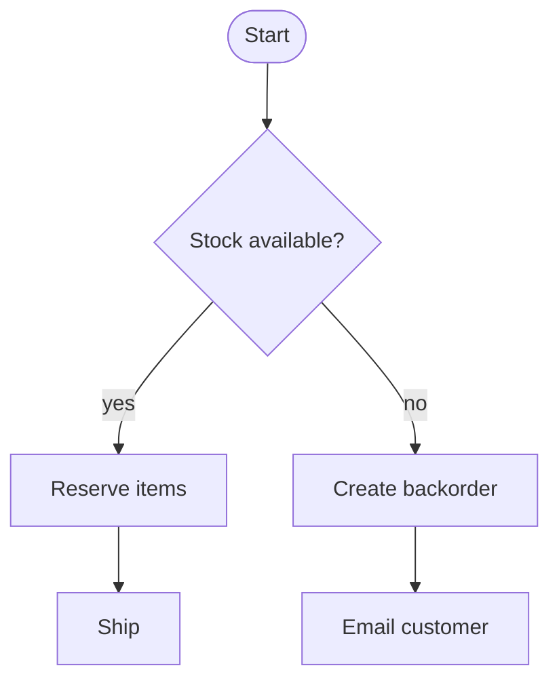

# Order fulfilment

```mermaid
flowchart TD
  start([Start])
  check{Stock available?}
  reserve[Reserve items]
  backorder[Create backorder]
  start --> check
  check -->|yes| reserve
  check -->|no| backorder
  reserve --> ship[Ship]
  backorder --> notify[Email customer]
```

Backorders are reviewed daily.
