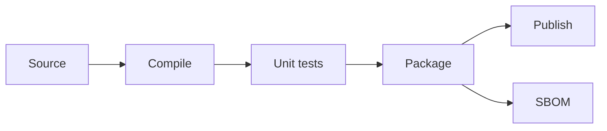

# Build

```mermaid
flowchart LR
  src[Source] --> compile[Compile]
  compile --> unit[Unit tests]
  unit --> package[Package]
  package --> publish[Publish]
  package --> sbom[SBOM]
```

Builds run on every push. Every package ships with an SBOM.
