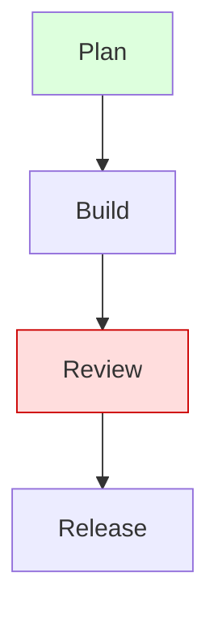

# Release checklist

Red boxes are blocked.

```mermaid
flowchart TD
  plan[Plan] --> build[Build]
  build --> review[Review]
  review --> release[Release]
  classDef done fill:#dfd
  class review blocked
  class plan done
  classDef blocked fill:#fdd,stroke:#c00
```

Update the diagram at each stand-up.
