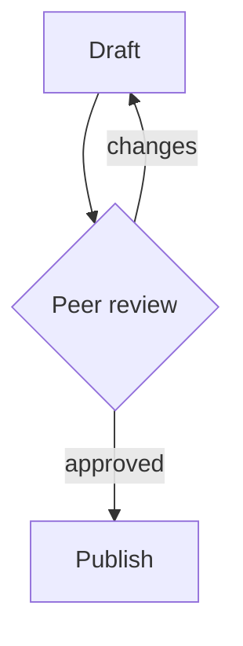

# Writing guide

How an article moves from draft to publication:

```mermaid
flowchart TD
  draft[Draft] --> review{Peer review}
  review -->|changes| draft
  review -->|approved| publish[Publish]
```

## Style

Use sentence case for headings.

## Tooling

Drafts live in the `articles/` folder.
