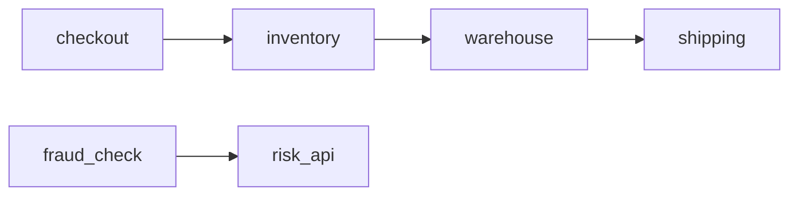

# Checkout services

```mermaid
graph LR
  checkout --> inventory
  inventory --> warehouse
  fraud_check --> risk_api
  warehouse --> shipping
```

Every call has a two-second timeout. Checkout no longer calls fraud screening
itself; the payment provider does it.
