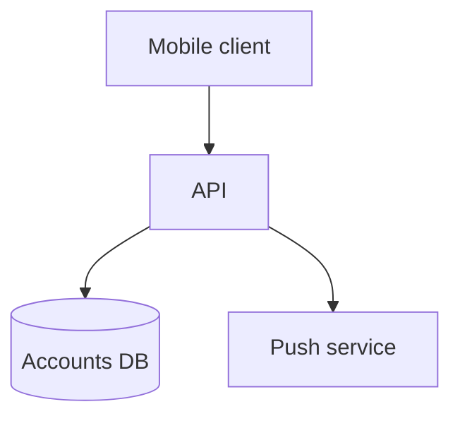

# Accounts

```mermaid
flowchart TD
  client[Mobile client]
  api[API]
  db[(Accounts DB)]
  push[Push service]
  client --> api --> db
  api --> push
```

The push service is optional in self-hosted installs.
