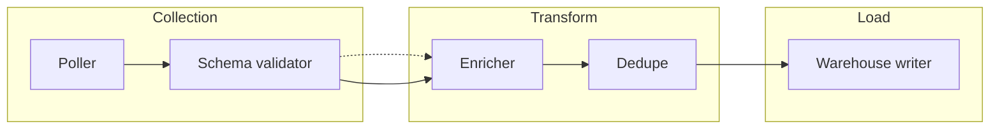

# ETL

```mermaid
flowchart LR
  poller[Poller]
  validator[Schema validator]
  enrich[Enricher]
  dedupe[Dedupe]
  writer[Warehouse writer]
  subgraph collect [Collection]
    poller
    validator
  end
  subgraph transform [Transform]
    enrich
    validator -.-> enrich
    dedupe
  end
  subgraph load [Load]
    writer
  end
  poller --> validator --> enrich --> dedupe --> writer
```

Runs hourly. The enricher asks the validator for schema versions.
