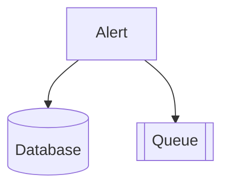

# On-call map

Click a box to open its runbook.

```mermaid
flowchart TD
  alert[Alert] --> db[(Database)]
  alert --> queue[[Queue]]
  click db href "https://wiki.example.com/runbooks/db" _blank
  click queue href "https://wiki.example.com/runbooks/queue" _blank
```

Runbooks are reviewed every quarter.
