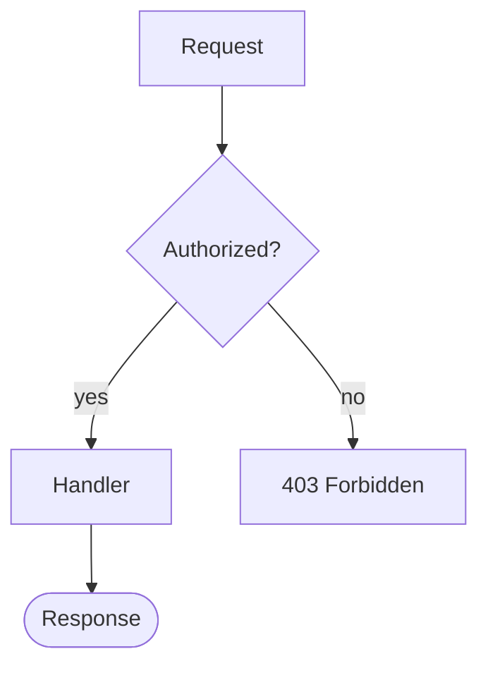

# Request authorization

```mermaid
flowchart TD
  req[Request] --> authz{Authorized?}
  authz -->|yes| handler[Handler]
  authz -->|no| deny[403 Forbidden]
  handler --> resp([Response])
```

Tokens are checked against the policy service.
