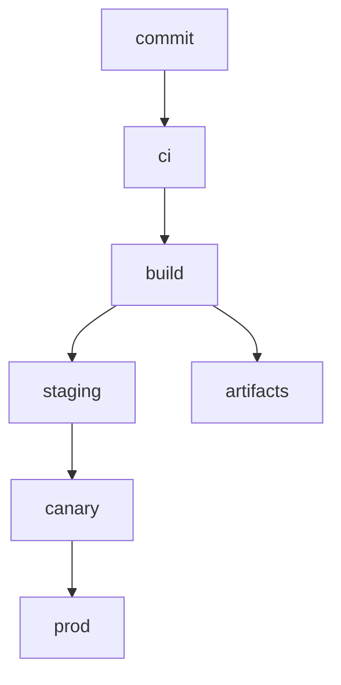

# Release train

Every change rides the same path to production. The canary stage holds a
release for thirty minutes while error rates are compared.

```mermaid
graph TD
  commit --> ci
  ci --> build
  build --> staging
  staging --> canary
  canary --> prod
  build --> artifacts
```

Artifacts are kept for ninety days.
