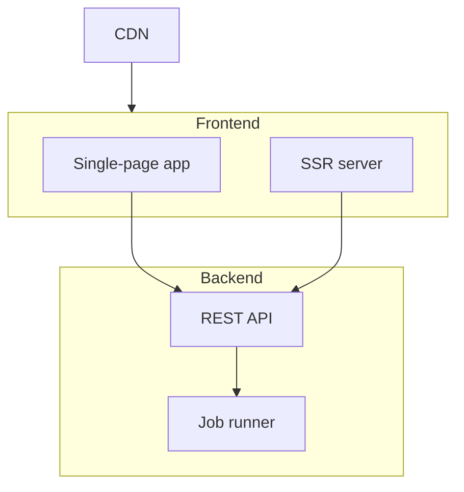

# Web tier

The frontend and backend deploy separately.

```mermaid
flowchart TB
  subgraph fe [Frontend]
    spa[Single-page app]
    ssr[SSR server]
  end
  subgraph be [Backend]
    api[REST API]
    jobs[Job runner]
  end
  spa --> api
  ssr --> api
  api --> jobs
  cdn[CDN] --> fe
```

See `deploy/` for the manifests.
