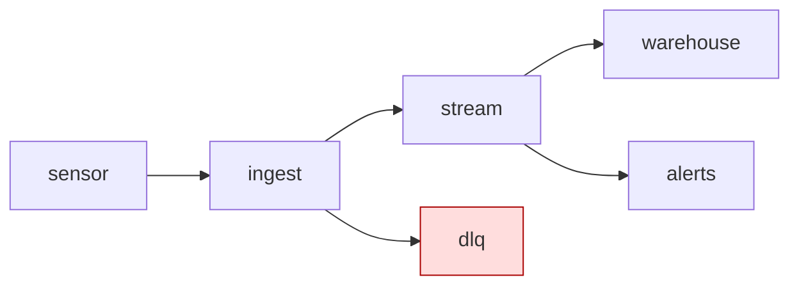

## Telemetry path

```mermaid
graph LR
  sensor --> ingest
  ingest --> stream
  ingest --> dlq
  style dlq fill:#fdd,stroke:#a00
  stream --> warehouse
  stream --> alerts
```

Late events are dropped after one hour. Malformed events go to the dead
letter queue.
