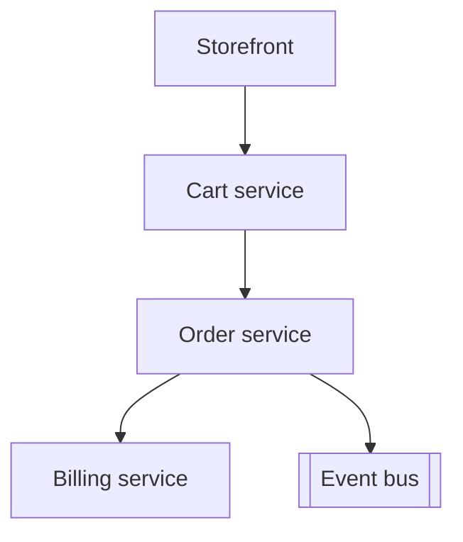

# Shop services

```mermaid
flowchart TB
  web[Storefront] --> cart[Cart service]
  cart --> orders[Order service]
  orders --> billing[Billing service]
  orders --> mq[[Event bus]]
```

Each service owns its own database.
