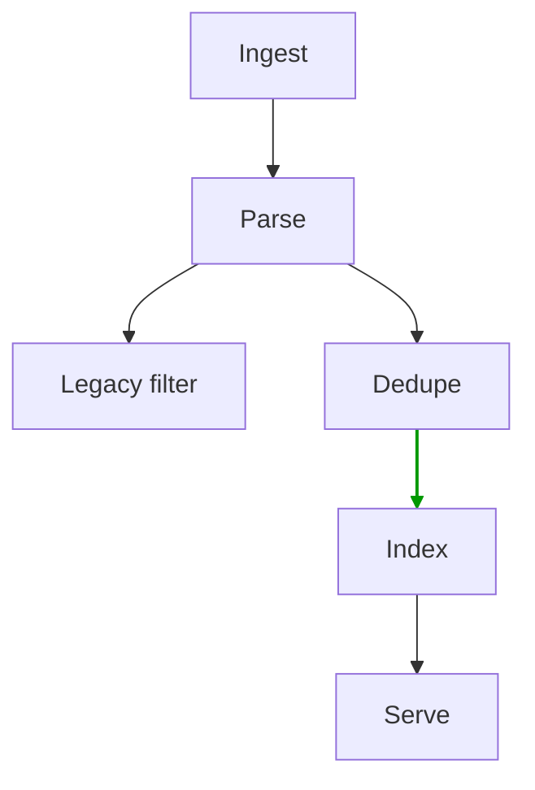

# Indexing pipeline

The green arrow is the step with an SLO.

```mermaid
flowchart TD
  a[Ingest] --> b[Parse]
  b --> c[Legacy filter]
  b --> d[Dedupe]
  d --> e[Index]
  e --> f[Serve]
  linkStyle 3 stroke:#090,stroke-width:2px
```

Parse errors are retried twice. Metrics are now scraped, not pushed.
